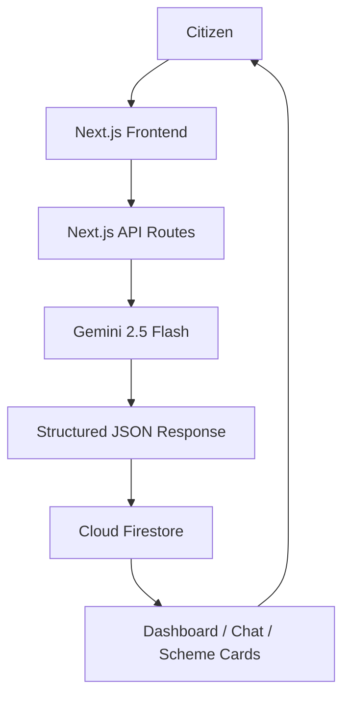
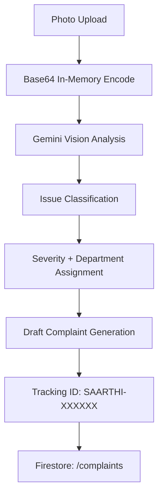

# 🇮🇳 Saarthi AI

### Har Nagarik Ka Digital Saathi
**India's AI-Powered Civic Companion**

[](https://nextjs.org/)
[](https://ai.google.dev/)
[](https://firebase.google.com/)
[](https://tailwindcss.com/)
[](https://vercel.com/)
[](#license)
[](#built-for)

> Built for **DEVENGERS PromptWars 2026** · Theme: *Smart Bharat – AI-Powered Civic Companion*

🔗 **Live Demo:** [https://saarthi-ai-tau.vercel.app](https://saarthi-ai-tau.vercel.app)

---

## Table of Contents

- [The Problem](#the-problem)
- [Our Solution](#our-solution)
- [Key Features](#key-features)
- [Requirements](#requirements)
- [AI Architecture](#ai-architecture)
- [System Architecture](#system-architecture)
- [Tech Stack](#tech-stack)
- [Project Structure](#project-structure)
- [Firestore Schema](#firestore-schema)
- [API Reference](#api-reference)
- [UI & Design Philosophy](#ui--design-philosophy)
- [What Makes Saarthi AI Different](#what-makes-saarthi-ai-different)
- [Getting Started](#getting-started)
- [Known Limitations](#known-limitations)
- [Future Roadmap](#future-roadmap)
- [Prompt Workflow / Strategy](#prompt-workflow--strategy)
- [Contributing](#contributing)
- [License](#license)

---

## The Problem

Millions of citizens struggle to access government welfare schemes and municipal services because of language barriers, dense bureaucratic terminology, and information scattered across disconnected portals. Filing a civic complaint — a pothole, a broken streetlight, a garbage pile — means knowing which department to petition and how to draft a formal request, something most citizens simply don't know how to do. This access gap disproportionately affects the citizens who need public services the most.

## Our Solution

Saarthi AI closes the gap by consolidating scheme discovery, document guidance, and civic grievance reporting into one conversational, multilingual interface. A citizen can ask a question in Hindi and get an answer in Hindi. They can upload a photo of a pothole and get a formally drafted, department-routed complaint in seconds. Every interaction is designed to feel like talking to a knowledgeable friend, not filling out a government form — with the trust markers (verified sources, confidence scores) that a civic tool needs to earn.

---

## Key Features

<table>
<tr><td width="50%">

### 💬 Ask Saarthi (AI Chat)
Real-time conversation powered by Gemini 2.5 Flash. Detects the language the user types in and responds in kind — context-aware, not a scripted FAQ bot.

</td><td width="50%">

### 🏛️ Dynamic Scheme Matching
When Gemini identifies a relevant welfare scheme in conversation (PM-Kisan, Ayushman Bharat, PMAY-U, etc.), it returns structured JSON matched against a Firestore-seeded database of 15 real schemes — rendered as Scheme Cards with eligibility tags, required documents, and a confidence score.

</td></tr>
<tr><td width="50%">

### 📸 Report with Photo (AI Vision)
Upload a photo of a civic issue. The image is base64-encoded and sent directly to Gemini's vision API in the same request — **never stored** — returning issue type, severity, responsible department, estimated resolution time, and a drafted formal complaint.

</td><td width="50%">

### 🆔 Tracking Registry
Every complaint gets a unique tracking ID (`SAARTHI-XXXXXX`) and a status record (`Pending` / `In Progress` / `Resolved`) saved to Firestore.

</td></tr>
<tr><td width="50%">

### 🗣️ Explain Simply / Translate
On-demand Gemini calls that rewrite any AI response in simpler language or translate it into another supported Indian language.

</td><td width="50%">

### 🔊 Listen (Text-to-Speech)
Uses the browser's native Web Speech API to read responses aloud — zero extra API cost, zero backend dependency.

</td></tr>
<tr><td width="50%">

### 📊 Citizen Dashboard
Quick-action tiles, suggested civic tasks, and live civic alerts in one glanceable view.

</td><td width="50%">

### 🌗 Light / Dark Mode
Persistent theme switching via `next-themes`, with a dedicated dark charcoal palette (`#10182B`) rather than a simple invert.

</td></tr>
<tr><td width="50%">

### 🌐 Multilingual UI
Full interface localization across 5 Indian languages (English, हिन्दी, বাংলা, தமிழ், मराठी) via a lightweight custom i18n context.

</td><td width="50%">

### 🛡️ Explainability
Confidence badges, "AI-Generated Guidance" labels, and verified-source links on every recommendation — so citizens (and judges) always know what's AI-inferred vs. sourced.

</td></tr>
</table>

> **Note on scope:** authentication is intentionally mocked for this demo (see [Known Limitations](#known-limitations)) — every feature above is otherwise a real, working integration against live Gemini and Firestore endpoints, not a static mockup.

---

## Requirements

### Functional Requirements

**Civic Assistant & Schemes**
- AI-powered conversational assistant for government-related queries
- Personalized government scheme recommendations with eligibility tags
- Multilingual conversation support (English, Hindi, Bengali, Tamil, Marathi)
- AI-generated plain-language explanations of government procedures
- Scheme eligibility confidence scoring
- AI-generated document requirement suggestions

**Civic Issue Reporting**
- Photo-based civic issue detection via Gemini Vision
- Automatic complaint draft generation from uploaded images
- Severity classification (Low / Medium / High)
- Responsible department recommendation (PWD, Municipal Corporation, etc.)
- Estimated resolution time prediction
- Unique complaint tracking ID generation

**Platform**
- Personalized dashboard with civic suggestions
- Dark / light mode switching
- Text-to-speech response playback
- Responsive mobile and desktop experience
- Firestore persistence for chat history and complaint records

### Non-Functional Requirements

| Category | What Saarthi AI does |
|---|---|
| ⚡ **Performance** | AI responses returned within a few seconds via streamlined API routes; Next.js App Router for fast navigation |
| 🔒 **Security** | API keys held server-side in environment variables only; never exposed to the client; Firestore access scoped to app-level rules |
| 🌐 **Accessibility** | High-contrast UI, large touch targets, simplified language, responsive across screen sizes |
| 📱 **Usability** | Minimal learning curve, consistent components, visible loading states during AI calls |
| 📈 **Scalability** | Modular Next.js/component architecture; adding a new scheme is a Firestore document, not a code change |
| 🛠 **Maintainability** | Clean folder separation between UI, API routes, and data layer; reusable components |
| 🔄 **Reliability** | Structured JSON-schema-enforced Gemini outputs reduce malformed responses; graceful error states on API failure |
| 🌍 **Compatibility** | Modern evergreen browsers, mobile-first responsive layout |
| 🤖 **AI Quality** | Context-aware, multilingual, explainable — every recommendation carries a confidence score |
| ☁️ **Deployment** | Git-based CI/CD via Vercel; redeploys automatically on push |

---

## AI Architecture

Saarthi AI is built entirely on **Google Gemini 2.5 Flash**, chosen for a specific reason: it's the only model in its class offering low-latency **multimodal** reasoning (text + vision) with native **structured JSON output**, at a cost and speed profile that works for a real-time citizen-facing chat and photo pipeline — not just a batch job.

Gemini 2.5 Flash powers:

- **Natural Language Understanding** — parsing free-form civic questions in multiple languages
- **Scheme Recommendation** — mapping conversational intent to structured scheme metadata
- **Conversation Memory** — maintaining context across a chat session via message history
- **Image Understanding** — classifying civic issues from a single photo (Gemini Vision)
- **Complaint Generation** — drafting formal, department-appropriate complaint text
- **Multilingual Responses** — detecting input language and responding in kind
- **Structured JSON Outputs** — every endpoint enforces a response schema so the frontend never has to parse freeform text

---

## System Architecture



**Photo-to-Complaint pipeline:**



No image is ever written to disk or cloud storage — uploaded photos are processed in-memory and passed straight to Gemini's vision endpoint within the same request, then discarded.

---

## Tech Stack

| Layer | Technology | Purpose |
|---|---|---|
| Frontend | Next.js 14.2.35 (App Router) | Routing, SSR, API routes |
| Frontend | React 18 | UI library |
| Frontend | Tailwind CSS 3.4.1 | Styling, brand color system |
| Frontend | shadcn/ui | Component primitives |
| Frontend | Framer Motion 12.42.2 | Animations & transitions |
| Frontend | next-themes 0.4.6 | Light/dark mode |
| Frontend | Lucide React | Icons |
| Backend | Next.js API Routes | Serverless backend logic |
| Backend | @google/genai 2.10.0 | Gemini 2.5 Flash — chat + vision |
| Backend | Firebase Firestore 12.15.0 | Chats, complaints, schemes database |
| Deployment | Vercel | CI/CD, hosting |

---

## Project Structure

```
saarthi-ai/
├── app/
│   ├── api/
│   │   ├── analyze-complaint/   # Gemini Vision + Firestore
│   │   └── chat/                # Gemini Chat + scheme matching
│   ├── assistant/                # Ask Saarthi UI
│   ├── dashboard/                # Citizen Dashboard UI
│   ├── report/                   # Photo reporting upload & checklist
│   ├── globals.css               # Glassmorphism utilities, mesh gradients
│   └── layout.tsx                # Root layout, fonts, providers
├── components/                   # GlassCard, ThemeToggle, Logo, SchemeCard, etc.
├── lib/
│   ├── firebase.ts               # Firebase client SDK initializer
│   ├── i18n.tsx                  # Translation context & useLanguage() hook
│   └── schemes-seed.ts           # Static schemes dataset
├── scripts/
│   └── seed-schemes.js           # Firestore seeding script
├── prompts/                       # Real prompts used at each build stage
├── .env.example
├── .gitignore
├── next.config.mjs
├── tailwind.config.ts
└── tsconfig.json
```

---

## Firestore Schema

### `/schemes/{schemeId}`
```typescript
interface Scheme {
  name: string;                  // e.g. "PM Kisan Samman Nidhi"
  description: string;
  eligibilityCriteria: string[];
  requiredDocuments: string[];
  sourceUrl: string;              // official government link
}
```

### `/complaints/{trackingId}`
```typescript
interface Complaint {
  issueType: string;              // e.g. "road_damage", "garbage_pile"
  severity: "Low" | "Medium" | "High";
  department: string;             // e.g. "Public Works Department"
  estimatedResolution: string;    // e.g. "3 Days"
  complaintText: string;          // AI-drafted petition
  status: "Pending" | "In Progress" | "Resolved";
  timestamp: FieldValue;
}
```

### `/chats/{userId}/messages`
```typescript
interface Message {
  role: "user" | "assistant";
  text: string;
  timestamp: FieldValue;
}
```
> `userId` is mocked as `demo-user-1` for this demo build (see [Known Limitations](#known-limitations)).

---

## API Reference

### `POST /api/chat`
```json
// Request
{
  "message": "string",
  "history": [{ "role": "user", "text": "previous query" }],
  "language": "en",
  "action": "explain | translate",
  "targetLanguage": "hi"
}

// Response
{
  "text": "Generated chat response",
  "recommendedSchemes": [
    { "schemeName": "PM Kisan Samman Nidhi", "eligibilityTags": ["Farming", "Rural"], "confidenceScore": 95 }
  ]
}
```

### `POST /api/analyze-complaint`
```json
// Request
{ "image": "data:image/jpeg;base64,...", "description": "optional user comment" }

// Response
{
  "trackingId": "SAARTHI-729415",
  "analysis": {
    "issueType": "road_damage",
    "severity": "High",
    "department": "Public Works Department",
    "estimatedResolution": "5 Days",
    "draftComplaint": "Drafted petition...",
    "confidenceScore": 95
  }
}
```

Both endpoints enforce a Gemini structured JSON response schema — the frontend never parses freeform text.

---

## UI & Design Philosophy

Premium, trust-forward civic aesthetic — built to feel like Linear, Notion, or Apple, not a legacy government portal, while still nodding to Digital India, UMANG, and DigiLocker as the category it belongs to.

| Token | Value | Use |
|---|---|---|
| Deep Navy | `#0B1F3A` | Primary background/surface |
| Saffron | `#FF9933` (gradient `#fe9832 → #ffb77a`) | Accent, CTAs |
| India Green | `#138808` | Success / verified states |
| Ashoka Blue | `#000080` | Trust badges |
| Dark charcoal | `#10182B` | Dark mode background |

- **Glassmorphism** via a shared `.glass-card` utility (translucent background, 16px blur, thin border)
- **16px rounded corners** across cards and inputs
- **Light + dark mode**, toggled with `next-themes`
- **Script-aware typography** — dedicated font variables `--font-sans`, `--font-hi` (Devanagari), `--font-bn` (Bengali) loaded in `layout.tsx` so Indian scripts render cleanly, not just transliterated Latin

---

## What Makes Saarthi AI Different

- **Photo-to-complaint, not form-to-complaint** — most civic apps still make you fill a form; Saarthi turns a phone photo into a routed, drafted complaint.
- **Explainable, not a black box** — every recommendation carries a confidence score and a labeled "AI-Generated Guidance" tag, so trust is earned, not assumed.
- **Multilingual by design, not by afterthought** — language detection and response happen in the same turn, in five Indian languages.
- **Privacy-first vision pipeline** — images are never persisted, a deliberate architectural choice, not a missing feature.
- **Modern UX for a civic-trust product** — glassmorphism and Apple/Linear-grade polish applied to a category that's historically been form-heavy and utilitarian.

---

## Getting Started

```bash
# 1. Clone
git clone <your-repo-url>
cd saarthi-ai

# 2. Install dependencies
npm install

# 3. Configure environment
cp .env.example .env.local
# then open .env.local and fill in real values

# 4. Seed the schemes database
node scripts/seed-schemes.js

# 5. Run locally
npm run dev
```

Visit [http://localhost:3000](http://localhost:3000).

**Demo access:** No login required — the app runs with a mocked identity (`Rohan Verma`, `uid: demo-user-1`) so judges can go straight to the dashboard.

### Environment Variables

| Variable | Purpose |
|---|---|
| `GEMINI_API_KEY` | Google AI Studio key for Gemini 2.5 Flash |
| `NEXT_PUBLIC_FIREBASE_API_KEY` | Firebase client SDK |
| `NEXT_PUBLIC_FIREBASE_AUTH_DOMAIN` | Firebase client SDK |
| `NEXT_PUBLIC_FIREBASE_PROJECT_ID` | Firebase client SDK |
| `NEXT_PUBLIC_FIREBASE_MESSAGING_SENDER_ID` | Firebase client SDK |
| `NEXT_PUBLIC_FIREBASE_APP_ID` | Firebase client SDK |

No real secrets are committed — see `.env.example` and `.gitignore`.

### Deployment

Deployed on **Vercel** with automatic CI/CD on push to `main`. Live at: **[saarthi-ai-tau.vercel.app](https://saarthi-ai-tau.vercel.app)**

---

## Known Limitations

- **No real authentication** — a mocked identity (`Rohan Verma`) is used for demo purposes; production would need proper auth-scoped Firestore rules.
- **Images are never persisted** — a deliberate privacy/cost decision, not a missing feature.
- **Voice is output-only** — text-to-speech via the browser's Web Speech API; there is no speech-to-text input yet (see roadmap).
- **Text-to-speech quality** depends on the browser/OS's available voices, particularly for non-English/Hindi languages.

## Future Roadmap

- Real citizen authentication with auth-scoped Firestore security rules
- Aadhaar and DigiLocker integration for verified document access
- Direct integration with official grievance pipelines (e.g. CPGRAMS)
- Two-way voice interaction (speech-to-text input alongside existing TTS)
- WhatsApp-based civic assistant channel
- GIS map view of reported issues
- Retrieval-Augmented Generation (RAG) over official government portals
- AI agent workflows for multi-step civic tasks
- Offline-first support for low-connectivity areas
- Predictive civic analytics and a citizen "digital twin" view
- Expand scheme database beyond the initial 15 seeded schemes

---

## Prompt Workflow / Strategy

This project was built using a deliberate multi-tool AI workflow:

- **Stitch** — UI/UX design generation for all core screens (light + dark mode)
- **Claude** — architecture planning, prompt engineering, implementation review, debugging, and this README
- **Antigravity** — code generation from design references into working Next.js code
- **Gemini 2.5 Flash** — the product's own AI engine (chat + vision), including structured JSON-schema prompting for scheme recommendation, vision classification, multilingual response generation, and safety-constrained complaint drafting

See `/prompts` in this repo for the actual prompts used at each stage.

---

## Contributing

This was built for a 4-hour hackathon, so contribution workflow is intentionally lightweight:

1. Fork the repo
2. Create a feature branch (`git checkout -b feature/your-feature`)
3. Commit your changes
4. Open a pull request describing what changed and why

## License

MIT

## Built For

**DEVENGERS PromptWars 2026** — Smart Bharat: AI-Powered Civic Companion

## Contributors

DEVENGERS Team — PromptWars 2026
